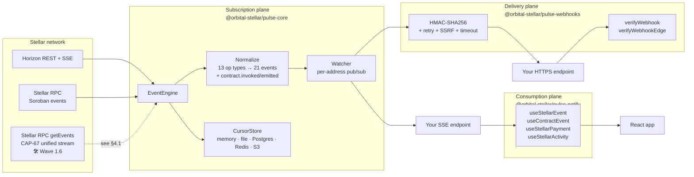
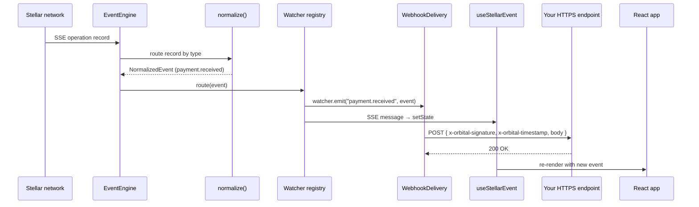
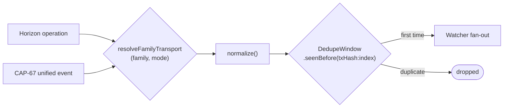

# Orbital - Architecture

> How the pieces fit together. This document is the map a new contributor reads
> before opening a PR, the reviewer consults before approving one, and the
> grant committee reads to understand what is actually being built.
>
> Where something ships today it is marked ✅; where it is planned it is
> marked 🛠️ and the milestone is named.

---

## Table of contents

1. [System overview](#1-system-overview)
2. [Component inventory & repo layout](#2-component-inventory--repo-layout)
3. [Event lifecycle](#3-event-lifecycle)
4. [The normalization layer](#4-the-normalization-layer)
5. [Reconnection, backoff, and rate limits](#5-reconnection-backoff-and-rate-limits)
6. [Webhook delivery internals](#6-webhook-delivery-internals)
7. [React hook internals](#7-react-hook-internals)
8. [Trust boundaries and invariants](#8-trust-boundaries-and-invariants)
9. [Reference composition (`apps/web`)](#9-reference-composition-appsweb)
10. [Shipped since Phase 0, and what's still ahead](#10-shipped-since-phase-0-and-whats-still-ahead)
11. [File map](#11-file-map)

---

## 1. System overview

Orbital is three planes sharing one vocabulary - the **normalized event**:

- **Subscription plane** - `@orbital-stellar/pulse-core` opens and maintains
  connections to Stellar (Horizon SSE and Stellar RPC for Soroban contract
  events), normalizes raw operations into a typed `NormalizedEvent` union, and
  routes each event to per-address `Watcher` subscribers.
- **Delivery plane** - `@orbital-stellar/pulse-webhooks` attaches to a `Watcher`,
  signs each event with HMAC-SHA256, and POSTs it to one or more HTTPS
  endpoints with retry, timeout, and SSRF safety. A second export
  (`verifyWebhookEdge`) lets receivers verify the signature on Cloudflare
  Workers, Vercel Edge, Deno, and browsers without Node `crypto`.
- **Consumption plane** - `@orbital-stellar/pulse-notify` opens a browser
  `EventSource` to a backend that re-emits the events as Server-Sent
  Events, and re-renders React components on each event.



Each plane is independently installable from npm and independently
composable. The reference composition that powers the marketing
demo at `apps/web/app/api/events/[address]/route.ts` shows all three wired
together inside a single Next.js route handler - about 50 lines of glue.

---

## 2. Component inventory & repo layout

| Component | Role | Path | Status |
|---|---|---|---|
| **`EventEngine`** | Owns the Horizon SSE stream, the reconnection state machine, the watcher registry, and the normalization pipeline. | `packages/pulse-core/src/EventEngine.ts` | ✅ |
| **`Watcher`** | `EventEmitter` keyed by Stellar address. Subscribers add listeners; the engine routes each normalized event to the matching watcher(s). | `packages/pulse-core/src/Watcher.ts` | ✅ |
| **Normalizers** | One method per Horizon operation type. Each returns a typed `NormalizedEvent` or `null` if the record is malformed. | `packages/pulse-core/src/EventEngine.ts` (`normalize*`) | ✅ |
| **`WebhookDelivery`** | Attaches to a `Watcher`, signs each event, POSTs it with retry + timeout + concurrent-retry cap. Emits `webhook.failed` / `webhook.dropped` on terminal failure. | `packages/pulse-webhooks/src/index.ts` | ✅ |
| **`verifyWebhook`** | Node-side HMAC verifier using `crypto.timingSafeEqual`. | `packages/pulse-webhooks/src/index.ts` | ✅ |
| **`verifyWebhookEdge`** | Edge-runtime HMAC verifier using Web Crypto API + constant-time XOR. | `packages/pulse-webhooks/src/edge.ts` | ✅ |
| **`@orbital-stellar/abi-registry`** | Shared Soroban ABI package that exports the canonical registry client, publisher interface, and scval conversion helpers. | `packages/abi-registry/src/index.ts` | ✅ |
| **`useStellarEvent<T>`** | React hook that opens an `EventSource`, parses incoming SSE messages, optionally filters by event type, and re-renders on each event. Stable dep-array via sorted `eventKey`. | `packages/pulse-notify/src/index.ts` | ✅ |
| **`useStellarPayment` / `useStellarActivity`** | Convenience wrappers over `useStellarEvent`. | `packages/pulse-notify/src/index.ts` | ✅ |
| **Reference composition** | A Next.js Node-runtime route handler that subscribes to an address and streams events as SSE; plus a `webhook-sample` route that returns an HMAC-signed payload for the demo. | `apps/web/app/api/events/[address]/route.ts`, `apps/web/app/api/webhook-sample/route.ts` | ✅ |
| **Soroban subscriber** | Subscribes to Stellar RPC for contract events, decodes via the ABI Registry, normalizes into the same `NormalizedEvent` union. | `packages/pulse-core/src/SorobanSubscriber.ts`, `SorobanRpcClient.ts` | ✅ |
| **Cursor persistence** | Pluggable durable store (`CursorStore`) for the Horizon/Soroban cursor so a process restart resumes from where it left off. Memory, file, Postgres, Redis, and S3 adapters. | `packages/pulse-core/src/CursorStore.ts` + adapters | ✅ |
| **Replay / retry adapters** | Pluggable durable queues (`RetryQueue`) for in-flight webhook retries. Memory, Redis, and SQS adapters. | `packages/pulse-webhooks/src/RetryQueue.ts` + adapters | ✅ |

---

## 2.1 ABI Registry (`@orbital-stellar/abi-registry`)

`@orbital-stellar/abi-registry` is the shared contract-interface package for Orbital.

- It holds the canonical ABI client surface for Soroban event decoding and publishing.
- It keeps ABI-related helpers in one place instead of duplicating schema logic in `pulse-core` or application code.
- It exposes the registry-facing building blocks the rest of the repo consumes: `AbiRegistryClient`, `RegistryPublisher`, `LocalFilePublisher`, `scvalToJs`, and `jsToScval`.
- It is the MIT package surface. The hosted registry service described in `docs/open-source-policy.md` is a separate product boundary.

The package-level reference lives in [`packages/abi-registry/README.md`](../packages/abi-registry/README.md).

Above decode sits the **semantic layer** — taxonomy mappings (e.g.
`transfer` → `token.transferred`, `swap` → `swap.executed`) and entity
labels (contract → protocol / issuer). Unmapped events stay unmapped; the
layer never guesses a name. Full explanation and a live mainnet worked
example: [`docs/semantic-layer.md`](./semantic-layer.md).

---

## 3. Event lifecycle

End-to-end for a single payment event from on-chain to React render:



Steps in detail:

1. **Subscribe.** Caller invokes `engine.subscribe(address)`. The engine
   creates a new `Watcher` (or returns an existing one), registers a
   `stopHandler` for cleanup, and stores any optional `filter` predicate.
2. **Ingest.** Horizon streams an operation record. The engine's `onmessage`
   callback updates `lastEventAt` and asks the normalizer to map the record
   to a `NormalizedEvent`. Records that don't match any known op type are
   dropped silently; records that fail field validation are dropped with a
   warn log.
3. **Route.** Each event type has a routing rule encoded in
   `EventEngine.route()`. Payments route to both `from` and `to` watchers;
   account merges to source and destination; trust-auth events to issuer and
   trustor; claimables to every claimant plus the sponsor. The same event
   never delivers to the same watcher twice.
4. **Filter.** If the subscriber passed a `filter` predicate, the engine
   calls it; a `false` return suppresses delivery. A thrown predicate is
   treated as `false` and logged as a warning - the stream stays up.
5. **Emit.** The watcher emits the event under its discriminated type
   (`"payment.received"`) and also under the wildcard `"*"`. Consumers can
   listen to either or both.
6. **Deliver.** Any `WebhookDelivery` attached to the watcher signs the
   payload, POSTs it, and handles retry on failure. Any `useStellarEvent`
   hook attached via SSE receives the event and updates React state.

---

## 4. The normalization layer

Horizon's operation records are denormalized JSON keyed by operation type.
`pulse-core` exposes them as a single discriminated union so consumers can
exhaustively switch on `event.type`:

```ts
type NormalizedEvent =
  | PaymentEvent
  | AccountOptionsEvent
  | AccountCreatedEvent
  | TrustlineEvent
  | AccountMergeEvent
  | OfferEvent
  | BumpSequenceEvent
  | DataEvent
  | ClaimableCreatedEvent
  | ClaimableClaimedEvent
  | LiquidityPoolDepositEvent
  | LiquidityPoolWithdrawEvent
  | TrustAuthEvent;
```

The 13 Horizon operation types map to **21 normalized event types** - the
difference comes from operations that fan out into multiple semantic events
(a `change_trust` becomes one of `trustline.added`, `trustline.removed`, or
`trustline.updated` depending on the new limit; a `manage_sell_offer` becomes
one of `offer.created`, `offer.updated`, or `offer.deleted` depending on the
offer ID and amount).

Asset encoding is normalized to a single string: `"XLM"` for native, or
`"CODE:ISSUER"` for credit assets. This sidesteps the Horizon convention of
`asset_type` + `asset_code` + `asset_issuer` triples in every operation.

The full taxonomy is documented in
[`packages/pulse-core/README.md`](../packages/pulse-core/README.md#event-taxonomy)
and the per-event TypeScript shapes live in
[`packages/pulse-core/src/index.ts`](../packages/pulse-core/src/index.ts).

---

## 4.1 Unified event ingestion (CAP-67) 🛠️

Protocol 23's CAP-67 lets classic asset movements (transfer, mint, burn,
clawback, `set_authorized`) emit Soroban-format events in a single stream,
fetched the same way contract events already are - `SorobanRpcClient.getEvents()`.
This is a third transport alongside Horizon SSE and the Soroban contract-event
subscriber, tracked as Wave 1.6 in [`ROADMAP.md`](../ROADMAP.md) and designed
in [`docs/design/cap67-mapping.md`](./design/cap67-mapping.md) (see also
[`docs/CAP-67-Event-Mapping.md`](./CAP-67-Event-Mapping.md) for the taxonomy
rationale). As of this writing the pieces below exist as independent,
tested building blocks; wiring them into `EventEngine`'s live delivery path -
so a family routed to "unified" actually stops arriving via Horizon and
starts arriving via the unified stream instead - is still forthcoming.

**Ingestion mode.** `CoreConfig.ingestion?: "unified" | "horizon" | "auto"`
(default `"horizon"`) selects a transport preference. `"horizon"` is the
default specifically so that existing consumers see zero behavior change
until they opt in. `"auto"` is meant to prefer `"unified"` once the
configured Soroban RPC is confirmed CAP-67-capable, falling back to
`"horizon"` otherwise. The flag is validated at construction (an unknown
value throws) and reported back via `engine.status().ingestion`.

**Routing decision.** Not every event family has a CAP-67 equivalent - per
the mapping design doc, only classic payments (transfer/mint/burn) and
trustline authorization (`set_authorized`) do. Everything else (account
options, account creation, account merges, trustline limit changes, offers,
bump-sequence, `manage_data`, claimable balances, liquidity pools) has no
unified-stream equivalent and stays Horizon-only under every mode.
`resolveFamilyTransport(family, effectiveMode)` is the pure function
encoding this:

| Event family | Under `"horizon"` mode | Under `"unified"` mode |
|---|---|---|
| `payment` (transfer/mint/burn) | Horizon | Unified |
| `trustlineAuth` (`set_authorized`) | Horizon | Unified |
| `trustlineLimit`, `accountCreated`, `accountOptions`, `accountMerge`, `offer`, `bumpSequence`, `manageData`, `claimableBalance`, `liquidityPool` | Horizon | Horizon |

`"auto"` mode is designed to resolve to one of the two columns above (never
a third behavior) based on the CAP-67-capability probe described above -
that probe isn't implemented yet, so `"auto"` currently behaves like
`"horizon"` in practice.

**Dedupe window.** During a routing transition - a mode switch, or `"auto"`
falling back and recovering - both transports can briefly observe the same
on-chain movement, which would otherwise reach a `Watcher` twice.
`deriveDedupeKey({ txHash, index })` derives one key per movement regardless
of which transport observed it (a Horizon operation and a CAP-67 event both
carry a transaction hash; `index` is the operation's position in the tx, or
the unified event's ordinal). `DedupeWindow` holds a bounded set of
recently-seen keys ahead of `Watcher` fan-out - `seenBefore(key)` returns
`true` for a duplicate, and the oldest key is evicted once the window is at
capacity, so memory never grows unbounded no matter how long the engine runs.



A COOKBOOK recipe for migrating an existing Horizon-only deployment onto
unified ingestion, once live routing lands, is planned but not yet written.

---

## 5. Reconnection, backoff, and rate limits

Horizon's SSE stream is not durable. Network blips, process restarts, and
upstream maintenance windows all surface as `onerror` callbacks. The
reconnection state machine is the single most load-bearing piece of
`pulse-core` for production reliability.

### Backoff policy

The engine uses **AWS Full Jitter**: each reconnect delay is a uniform random
value between `0` and `min(initialDelayMs × 2^(attempt-1), maxDelayMs)`. This
avoids the thundering-herd problem where every dropped client reconnects on
the same millisecond when Horizon comes back.

Defaults: `initialDelayMs: 1000`, `maxDelayMs: 30000`, `maxRetries: ∞`. All
three are overridable via `CoreConfig.reconnect`.

### Rate-limit handling

A `429 Too Many Requests` response is not treated as a generic error. The
engine parses the `Retry-After` header (either integer seconds or an HTTP
date), schedules the reconnect for exactly that delay, and emits an
`engine.rate_limited` notification on every watcher so consumers can show
banners or pause publishers. If the header is missing or malformed, the
engine falls back to a 60-second delay (longer than the exponential default).

### Lifecycle notifications

Every watcher receives lifecycle notifications alongside operation events:

| Notification | When |
|---|---|
| `engine.reconnecting` | Backoff delay started; will reconnect in `delayMs` |
| `engine.reconnected` | Reconnect succeeded on attempt `N` |
| `engine.rate_limited` | 429 received; reconnect deferred by `delayMs` |
| `engine.stopped` | `engine.stop()` was called explicitly |
| `engine.cursor_expired` | Stream cursor expired (Horizon or Soroban) |

For `engine.cursor_expired` notifications, the payload includes:
- `lostCursor?: string` - The value of the expired or lost cursor.
- `source?: "horizon" | "soroban"` - The subscription engine source where the expiry occurred.

Consumers can subscribe to these via `watcher.on("engine.reconnecting", …)`
to surface UI banners or write structured logs.

### In-process backpressure and bounded queues

To protect consumers from unbounded memory growth when a watcher is slow or
there's a burst of ledger activity, `EventEngine` now maintains a bounded
internal queue. Configuration lives in `CoreConfig.queue` and exposes three
knobs:

- **`highWaterMark`**: the maximum queued events before backpressure triggers (default: 10000).
- **`lowWaterMark`**: the level below which backpressure is considered cleared (default: 50% of highWaterMark).
- **`policy`**: one of `pause` (default), `drop-oldest`, or `drop-newest`.

When the high-water mark is crossed the engine emits `engine.backpressure`
with `{ active: true, queued, policy }`. The default `pause` policy stops
the underlying sources (Horizon and Soroban) until the queue drains below the
low-water mark, at which point `engine.backpressure` with `{ active: false }`
is emitted and sources are resumed. `drop-oldest` and `drop-newest` shed
events deterministically instead of pausing the source; these are useful for
best-effort dashboards where availability is preferred over perfect delivery.

---

## 6. Webhook delivery internals

`WebhookDelivery` is a thin wrapper around `fetch` with five concerns:

1. **Signing.** HMAC-SHA256 over `${timestamp}.${payload}`, where `payload`
   is the JSON-serialized `NormalizedEvent`. The signature is hex-encoded
   and sent as the `x-orbital-signature` header. The timestamp prevents
   replay attacks; receivers should reject signatures older than a small
   window (recommended: 5 minutes).
2. **Timeout.** Each attempt has an `AbortController` cap (default 10 s,
   tunable via `deliveryTimeoutMs`). A timed-out attempt counts as a failure
   and triggers retry.
3. **Retry.** On any non-2xx response, network error, or timeout, the
   delivery schedules a retry after a jittered exponential delay (`2^(n-1)
   × 1000ms × Math.random()`). The default cap is 3 attempts.
4. **Concurrent-retry cap.** If too many endpoints are slow, retries can
   accumulate and exhaust memory. The cap (`maxConcurrentRetries`, default
   100) evicts the *newest* pending retry first when the limit is hit and
   emits a synthetic `webhook.dropped` event so consumers can route it to a
   dead-letter store.
5. **Terminal failure.** After all retries are exhausted, the delivery
   emits `webhook.failed` on the watcher with `{ error, url, attempts,
   originalEvent }` in `raw`. The watcher's `on("webhook.failed", …)`
   handler is the dead-letter integration point.

### SSRF safety

Delivery targets are validated at construction time and re-validated against
DNS resolution before each request. Loopback (`127.0.0.0/8`, `::1`), private
RFC 1918 ranges, and link-local (`169.254.0.0/16`) addresses are blocked by
default. Setting `allowPrivateNetworks: true` opts out - useful for local
development, never appropriate for production.

### Edge-runtime verification

`verifyWebhookEdge` is a parallel implementation of `verifyWebhook` that
uses Web Crypto's `crypto.subtle.sign` instead of Node's `createHmac`. It
runs on Cloudflare Workers, Vercel Edge, Deno, and browsers - anywhere with
the standard `crypto.subtle` API. The constant-time XOR comparison
substitutes for Node's `timingSafeEqual`.

This matters because the most common webhook receiver shape on Stellar
today is a Cloudflare Worker or a Vercel Edge route, and the Node crypto
verifier doesn't load there.

---

## 7. React hook internals

`useStellarEvent<T>` is intentionally thin: it acquires a pooled
`EventSource` connection and applies a per-hook event filter, with three
design choices worth noting.

**Connection pooling.** Hook instances with the same `serverUrl`, `address`,
and `token` share one browser `EventSource`; the pool closes that connection
when the last hook using the key unmounts.

**Stable dep-array.** An array literal passed as the `event` allowlist
would otherwise be a new reference every render and re-run the effect
continuously. The hook serializes the allowlist to a sorted string
(`eventKey`) and uses that as the dep instead.

**Dual call signature.** The hook accepts both a config object
(`useStellarEvent({ serverUrl, address, event })`) and a positional form
(`useStellarEvent(serverUrl, address, { event })`). The two are normalized
to the same four primitives before the effect runs.

**Generic type narrowing.** Passing a narrower union as `T` lets consumers
exhaustively switch on `event.type` without manual casts:

```tsx
type WalletEvents = Extract<NormalizedEvent, { type: "payment.received" | "payment.sent" }>;
const { event } = useStellarEvent<WalletEvents>(url, address, { event: ["payment.received", "payment.sent"] });
```

The hook is browser-only - `EventSource` doesn't exist in Node. In Next.js
App Router, mark consuming components with `"use client"`. In Remix or Vite
SSR, gate the hook behind a client-only boundary.

---

## 8. Trust boundaries and invariants

| Boundary | Inside | Outside | Mitigation |
|---|---|---|---|
| **Webhook signature** | The signed `${timestamp}.${payload}` body emitted by `WebhookDelivery`. | Network, intermediate proxies, the receiver's logs. | HMAC-SHA256 with a shared secret; `verifyWebhook` uses timing-safe comparison. |
| **Webhook target URL** | The host configured by the operator. | The DNS resolver and the network it points at. | SSRF block-list on construction *and* re-validated post-DNS to defend against DNS rebinding. |
| **SSE stream from Stellar** | `EventEngine` → `Watcher` callbacks. | Horizon, intermediate CDNs. | The engine treats every record as untrusted input - every field is `typeof`-checked before normalization; malformed records are dropped with a warn log, not thrown. |
| **API key on the demo backend** | A single `process.env.NEXT_PUBLIC_NETWORK`-validated singleton. | Public internet, every visitor. | The demo enforces a 1-stream-per-IP concurrency cap and a 25s session timer; production self-hosters should swap in their own auth (the SDKs do not prescribe one). |
| **HMAC secret** | The operator's secret store. | Source control, logs, debug output. | The reference composition reads from env; consumers are expected to use a secrets manager. |

### Invariants

- An `EventEngine` only ever holds one upstream connection at a time.
  `start()` is idempotent (returns `false` if already running, unless
  `strict: true` is passed).
- A `Watcher` only ever delivers to a given subscriber once per event.
- A `WebhookDelivery` retries each URL independently; one slow endpoint
  does not block delivery to the others.
- A stopped `Watcher` accepts no new listeners and emits no further events.
  Adding a listener after `stop()` is a no-op with a warn log.

---

## 9. Reference composition (`apps/web`)

The marketing site doubles as the runnable reference for "how do I wire
this together end-to-end?" Two API routes show the composition:

| Route | Powers | Cost-control |
|---|---|---|
| `GET /api/events/[address]` | The on-page Live Demo. Subscribes to the address, streams events as SSE, closes after the session cap. | 1 concurrent stream per IP; 25s max session. |
| `POST /api/webhook-sample` | The on-page Webhook Demo. Returns a real HMAC-SHA256-signed sample payload with `x-orbital-*` headers. | 1 signing request per IP per 20s. |

Both routes share a lazy `globalThis`-scoped `EventEngine` singleton
(`apps/web/lib/engine.ts`) that survives Next.js HMR. When the limits
trigger, the routes return a JSON envelope
(`{ error: "demo_limit_reached", reason, message, upgradeUrl }`) that the
React components surface as an "Upgrade to Orbital Cloud" CTA.

For production self-hosting, copy the route handlers, strip the limit
checks in `lib/demo-limits.ts`, and swap the in-memory singleton for a
proper process manager. The whole composition is under 200 lines of TS.

---

## 10. Shipped since Phase 0, and what's still ahead

The following bolted on without changing the public API surface consumers
already depend on:

- **Soroban event subscription.** A second source feeding into the same
  normalization pipeline. New event types
  (`contract.invoked`, `contract.emitted`) join the `NormalizedEvent` union;
  existing consumers ignore them unless they call
  `engine.subscribeContract({ contractId, topics })`.
- **ABI Registry client.** Decodes Soroban event topics + data into typed,
  human-readable JSON via `decodedData` on `contract.emitted`. Lives in the
  separate `@orbital-stellar/abi-registry` package so the registry data layer
  is independently versioned.
- **Cursor persistence.** A pluggable `CursorStore` interface stored on
  `EventEngine` config. Implementations: in-memory (default), local file,
  Redis, Postgres, S3. On reconnect with a configured store, the engine
  resumes from the stored cursor instead of `"now"`.
- **Replay adapters.** A pluggable `RetryQueue` interface on
  `WebhookDelivery`. Implementations: in-memory (default), Redis, SQS.
  Pending retries survive process restarts when configured.

Consumers opt in by passing new config (`cursorStore`, `retryQueue`,
`soroban`) - existing `on()` handlers are unaffected.

Still ahead (tracked in [`ROADMAP.md`](../ROADMAP.md) Wave 1.4–1.5):

- **Discriminated union refinement.** Today the `NormalizedEvent` union is
  discriminated by `type` but several fields are `unknown` for type-safety
  reasons (the raw Horizon record). A future pass narrows these to typed
  shapes with the help of generated schemas from Horizon's OpenAPI.
- **`STABILITY.md`** - a formal semver contract and deprecation window,
  the last gate before a `v1.0.0` tag.

---

## 11. File map

```
orbital_stellar/
├── packages/                      # Published SDKs (MIT, npm)
│   ├── pulse-core/
│   │   ├── src/                   # 27 files - engine, normalizers, routing,
│   │   │   │                      # Soroban subscriber/RPC client, 5 cursor-store
│   │   │   │                      # adapters, backoff, address/amount helpers
│   │   │   ├── EventEngine.ts     # ~2300 lines - engine + normalizers + routing
│   │   │   ├── SorobanSubscriber.ts   # Soroban RPC polling + reconnect
│   │   │   ├── SorobanRpcClient.ts    # Stellar RPC getEvents client
│   │   │   ├── CursorStore.ts + {Memory,File,Postgres,Redis,S3}CursorStore.ts
│   │   │   ├── Watcher.ts         # EventEmitter wrapper with stop-handler hooks
│   │   │   ├── errors.ts          # EngineAlreadyStartedError
│   │   │   └── index.ts           # Public types + barrel exports
│   │   ├── test/                  # Vitest suites (500+ passing across 50 files)
│   │   └── bench/                 # tsx benchmark harnesses (throughput, Soroban)
│   ├── pulse-webhooks/
│   │   ├── src/
│   │   │   ├── index.ts           # WebhookDelivery + verifyWebhook (Node)
│   │   │   ├── edge.ts            # verifyWebhookEdge (Web Crypto)
│   │   │   ├── signing.ts         # Shared HMAC signing helper
│   │   │   ├── RetryQueue.ts + {Memory,Redis,Sqs}RetryQueue.ts
│   │   │   ├── cli.ts, bin/orbital    # `orbital dlq` CLI (list/dump/replay)
│   │   │   └── types.ts           # WebhookConfig
│   │   └── test/                  # Vitest suites (180+ passing)
│   ├── pulse-notify/
│   │   └── src/index.ts + hooks   # useStellarEvent, useContractEvent,
│   │                               # useStellarPayment, useStellarActivity,
│   │                               # useStellarAddresses, useStellarHistory
│   └── abi-registry/
│       └── src/                   # AbiRegistryClient, LocalAbiRegistryClient,
│                                   # scval/JS conversion, schema validation
├── apps/
│   └── web/                       # Marketing site + reference composition
│       ├── app/
│       │   ├── api/
│       │   │   ├── events/[address]/route.ts   # Reference SSE handler
│       │   │   └── webhook-sample/route.ts     # HMAC-signed sample
│       │   ├── docs/              # File-based MD docs with TOC
│       │   └── page.tsx           # Marketing landing
│       ├── components/            # LiveDemo, WebhookDemo, Nav, Hero, …
│       ├── content/               # Markdown sources for /docs
│       └── lib/
│           ├── engine.ts          # globalThis EventEngine singleton
│           ├── network.ts         # NEXT_PUBLIC_NETWORK validation
│           └── demo-limits.ts     # Per-IP + per-session caps
├── docs/                          # Strategic + reference docs (this dir)
├── .github/workflows/             # CI, CodeQL, security, integration, release
├── PROGRESS.md                    # Status snapshot
├── ROADMAP.md                     # Multi-year phase plan
├── CHANGELOG.md                   # Rolled-up release notes
└── CONTRIBUTING.md                # Dev loop + PR conventions
```

---

## Related documents

- [`PROGRESS.md`](../PROGRESS.md) - Status snapshot and completion checklist
- [`ROADMAP.md`](../ROADMAP.md) - Phase 0 → Phase 4 timeline
- [`CHANGELOG.md`](../CHANGELOG.md) - Per-release notes
- [`docs/semantic-layer.md`](./semantic-layer.md) - Semantic taxonomy, labels, precedence, honesty rule
- [`docs/proposal.md`](./proposal.md) - SCF grant proposal
- [`docs/design/cap67-mapping.md`](./design/cap67-mapping.md) - CAP-67 → `NormalizedEvent` mapping design doc (§4.1)
- [`docs/CAP-67-Event-Mapping.md`](./CAP-67-Event-Mapping.md) - CAP-67 event taxonomy rationale (§4.1)
- Per-package READMEs:
  [`pulse-core`](../packages/pulse-core/README.md),
  [`pulse-webhooks`](../packages/pulse-webhooks/README.md),
  [`pulse-notify`](../packages/pulse-notify/README.md),
  [`abi-registry`](../packages/abi-registry/README.md)


## Performance benchmarks

The hot path of every event is normalization plus, for Soroban contract events,
spec resolution and decoding. A change that halves throughput there would ship
unnoticed without a guard, so `packages/pulse-core/bench/` holds a benchmark
suite that CI runs on every packages change and gates on regressions.

### What is measured

The suite runs four things against the recorded CAP-67 fixture corpus in
`packages/pulse-core/test/fixtures/cap67/`, so the numbers reflect pulse-core's
own work rather than network time:

- **normalize/raw-to-normalized** - a raw RPC event through `normalizeContractEvent`.
- **decode/cap67-transfer** - the CAP-67 unified `transfer` decoder over the
  transfer fixtures (bare `i128` and `SCMap`-with-memo forms).
- **watcher/fan-out-1, -100, -1000** - `Watcher.emit` dispatch at each fan-out width.
- **cursor/memory-set** and **cursor/memory-set-many-100** - cursor write cost
  for the in-memory adapter, single-key and batched.

### Running it
`bench` exits non-zero when any case is more than 20% slower than the committed
baseline, or when a baselined case has gone missing. Improvements never fail.
The harness is dependency-free (`node:perf_hooks` only) and reports the median of
many batched samples, so a single GC pause does not trip the gate.

### The baseline and how to update it

`packages/pulse-core/bench/baseline.json` is the committed reference. It records
each case's throughput alongside the machine the numbers came from, because a
throughput figure is meaningless without the hardware behind it.

Updating the baseline is deliberate. When a change legitimately moves the
numbers - a faster algorithm, or an accepted cost for new behavior - regenerate
the baseline with `bench:update` and **justify the change in the pull request
body**: what moved, why, and roughly by how much. A baseline bump without a
reason in the PR is treated as a red flag in review, because it is the one way a
real regression can be laundered into the reference.

The current committed baseline was generated on a developer workstation and is
noisier than a dedicated runner would produce; regenerate it on stable hardware
when convenient and record that environment here.